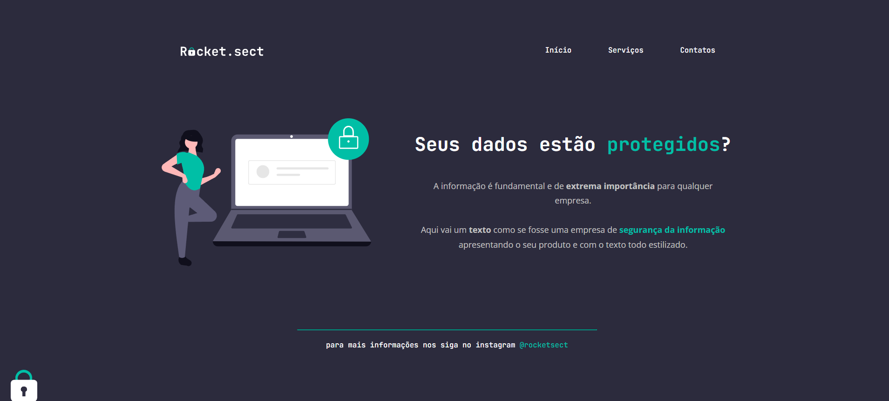

<h1 align="center">Explore - Rocketseat Projeto 04</h1>
<h3> Landing Page de apresentação do projeto desenvolvido no Explore da Rocketseat.</h3>

## Descrição do Projeto
Landing Page de apresentação do projeto desenvolvido no Explore da Rocketseat

## Instalação
Basta baixar o repositório na sua máquina, abrir na IDE de sua preferência e executar o arquivo HTML em seu navegador.

## Licença
MIT License.
Copyright (c) 2022.

## 🚀 Tecnologias Utilizadas

